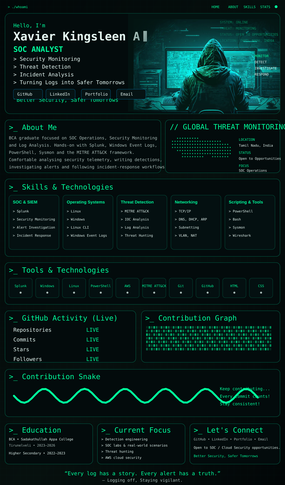
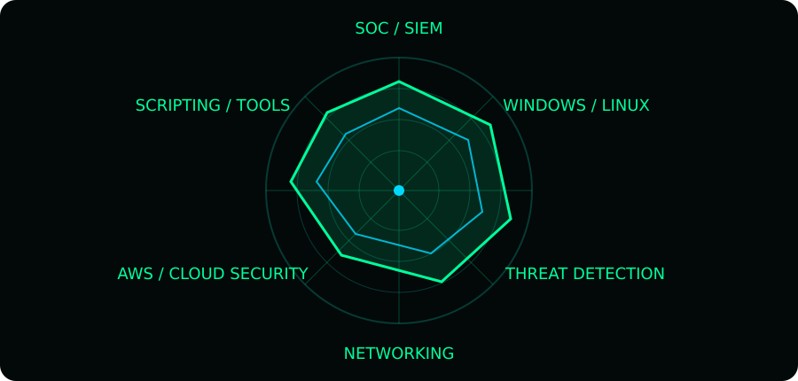

<a href="https://github.com/xavierkingsleen-11">GitHub</a> •
<a href="https://www.linkedin.com/in/xavierkingsleen01">LinkedIn</a> •
<a href="https://xavier11sr-myportfolio.netlify.app">Portfolio</a> •
<a href="mailto:xavierkingsleen@gmail.com">Email</a>

---

## `>_ GitHub Activity // LIVE`

---

## `>_ About Me`

I'm **Xavier Kingsleen A**, a BCA graduate focused on **SOC Operations, Security Monitoring, Log Analysis, Linux, Windows security telemetry, and AWS security**.

Hands-on areas include **Splunk Cloud, Windows Event Logs, PowerShell, Sysmon, MITRE ATT&CK, threat detection, alert investigation, incident-response workflows, and AWS cloud-security concepts**.

**Target:** Entry-level **SOC Analyst L1 / Security Operations**, with a long-term direction toward **Cloud Security**.

> **“Better Security, Safer Tomorrows.”**

---

## `>_ Skills & Technologies`

**SOC & SIEM:** `Splunk` `SPL` `Security Monitoring` `Alert Investigation` `Incident Response`  
**Systems:** `Linux` `Windows` `Linux CLI` `Windows Event Logs`  
**Detection:** `MITRE ATT&CK` `IOC Analysis` `Log Analysis` `Threat Hunting`  
**Networking:** `TCP/IP` `IPv4/IPv6` `DNS` `DHCP` `ARP` `NAT` `VLAN` `Subnetting`  
**Cloud:** `AWS` `IAM` `EC2` `S3` `VPC` `CloudWatch` `GuardDuty` `CloudTrail` `Lambda` `EventBridge` `Systems Manager`  
**Tools:** `PowerShell` `Bash` `Sysmon` `Wireshark` `VirusTotal` `Git` `GitHub` `HTML` `CSS`

---

## `>_ Tools & Technologies`

 

---

## `>_ Education`

**Bachelor of Computer Applications (BCA)**  
Sadakathullah Appa College, Tirunelveli • 2023–2026

**Higher Secondary Education (12th)**  
TNDTA RMP Pulamadan Chettiar National HR Sec School, Sathankulam • 2022–2023

---

## `>_ Current Focus`

- Detection engineering and SOC alert investigation
- Windows + Linux security monitoring labs
- Splunk / SIEM / MITRE ATT&CK workflows
- Threat hunting and incident-response fundamentals
- AWS cloud security
- SOC Analyst L1 interview preparation

---

## `>_ Let's Connect`

<a href="https://github.com/xavierkingsleen-11">GitHub</a> •
<a href="https://www.linkedin.com/in/xavierkingsleen01">LinkedIn</a> •
<a href="https://xavier11sr-myportfolio.netlify.app">Portfolio</a> •
<a href="mailto:xavierkingsleen@gmail.com">Email</a>

  

**“Every log has a story. Every alert has a truth.”**  
— **Logging off, Staying vigilant.**

