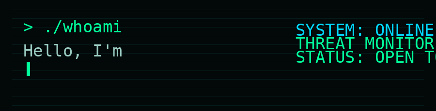
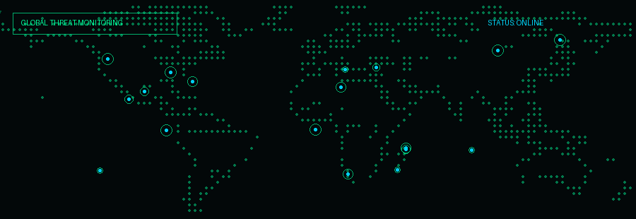

<b>Monitor &nbsp;|&nbsp; Detect &nbsp;|&nbsp; Investigate &nbsp;|&nbsp; Respond</b>

---

## `>_ About Me`

BCA graduate focused on **SOC Operations, Security Monitoring, Log Analysis, Linux, Windows security telemetry, and AWS security**. Hands-on with **Splunk Cloud, Windows Event Logs, PowerShell, Sysmon, MITRE ATT&CK, threat detection, alert investigation, and incident-response workflows**, with AWS experience across cloud infrastructure, monitoring, IAM, GuardDuty, CloudTrail, EventBridge, Lambda, and Systems Manager.

My working mindset is simple:

**Collect telemetry → Detect abnormal behavior → Investigate evidence → Respond → Document.**

**Current target:** Entry-level **SOC Analyst L1 / Security Operations** roles, with a longer-term direction toward **Cloud Security**.

> **“Better Security, Safer Tomorrows.”**

---

## `>_ Global Threat Monitoring`

**STATUS:** Open to Opportunities  
**FOCUS:** SOC Operations • Security Monitoring • Threat Detection • Cloud Security

---

## `>_ Skills & Technologies`

<table>
<tr>
<td width="16.6%" valign="top">

### 🛡️ SOC & SIEM
- Splunk
- SPL
- Security Monitoring
- Alert Investigation
- Incident Response

</td>
<td width="16.6%" valign="top">

### 🖥️ Systems
- Linux
- Windows
- Linux CLI
- Windows Event Logs
- System Administration

</td>
<td width="16.6%" valign="top">

### 🎯 Detection
- MITRE ATT&CK
- IOC Analysis
- Log Analysis
- Threat Hunting
- Process Analysis

</td>
<td width="16.6%" valign="top">

### 🌐 Networking
- TCP/IP
- IPv4 / IPv6
- DNS / DHCP
- ARP
- NAT / VLAN
- Subnetting

</td>
<td width="16.6%" valign="top">

### ☁️ Cloud
- AWS
- IAM
- EC2
- S3
- CloudWatch
- GuardDuty

</td>
<td width="16.6%" valign="top">

### ⚙️ Tools
- PowerShell
- Sysmon
- Bash
- Git / GitHub
- Wireshark
- VirusTotal

</td>
</tr>
</table>

---

## `>_ Tools & Technologies`

  

&nbsp;
&nbsp;
&nbsp;

---

## `>_ GitHub Activity // LIVE`

  

---

## `>_ Contribution Graph`

---

## `>_ Contribution Snake`

---

## `>_ Education`

**Bachelor of Computer Applications (BCA)**  
Sadakathullah Appa College, Tirunelveli • 2023–2026

**Higher Secondary Education (12th)**  
TNDTA RMP Pulamadan Chettiar National HR Sec School, Sathankulam • 2022–2023

---

## `>_ Current Focus`

- Improving **SOC detection engineering** and alert investigation.
- Building realistic **Windows + Linux security monitoring labs**.
- Strengthening **Splunk / SIEM / MITRE ATT&CK** investigation workflows.
- Learning **AWS cloud security** and cloud-native detection patterns.
- Preparing for **SOC Analyst L1** interviews and real-world triage scenarios.

---

## `>_ Let's Connect`

  

> **“Every log has a story. Every alert has a truth.”**  
> — **Logging off, Staying vigilant.**

