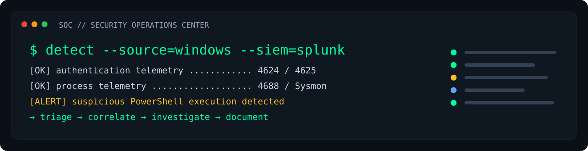
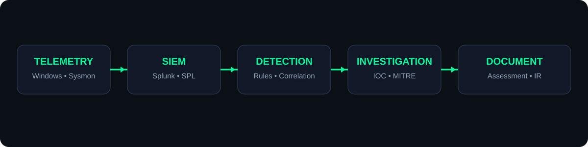
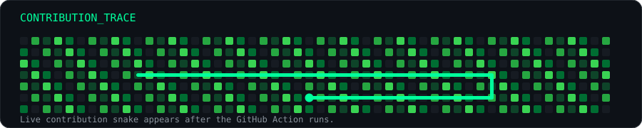

<!-- ========================================================= -->
<!-- Xavier Kingsleen | SOC Analyst GitHub Profile             -->
<!-- ========================================================= -->

<div align="center">



<table>
<tr>
<td width="28%" align="center">

</td>
<td width="72%" align="left">

# Hello, I'm Xavier Kingsleen

## `SOC ANALYST`

> **Monitor · Detect · Investigate · Respond**

**Security Monitoring** · **Threat Detection** · **Log Analysis** · **Incident Response**

BCA graduate focused on hands-on SOC operations, SIEM investigation, Windows telemetry, threat detection and practical security workflows.

**Current target:** Entry-level **SOC Analyst L1** opportunities.

</td>
</tr>
</table>

<a href="https://github.com/xavierkingsleen-11"></a>
&nbsp;
<a href="https://www.linkedin.com/in/xavierkingsleen01"></a>
&nbsp;
<a href="https://xavier11sr-myportfolio.netlify.app/"></a>

</div>

---

## `>_` SOC PROFILE

| Focus Area | What I Work With |
|---|---|
| 🛡️ **Security Operations** | Alert investigation, log analysis, authentication monitoring, process monitoring, incident-response fundamentals |
| 🔎 **Threat Detection** | MITRE ATT&CK, IOC analysis, suspicious PowerShell activity, phishing investigation, insider-threat detection |
| 📊 **SIEM** | Splunk Cloud, SPL searches, dashboards, correlation logic and security alerting |
| 🪟 **Windows Security** | Windows Event Logs, Event IDs, PowerShell, Sysmon, authentication and process telemetry |
| ☁️ **Cloud Security** | AWS IAM, CloudTrail, GuardDuty, KMS, CloudWatch, EventBridge, Lambda and Systems Manager |

---

## `01` SKILLS & TECHNOLOGY STACK

<table>
<tr>
<td width="20%" valign="top">

### 🛡️ SOC & SIEM
- Splunk Cloud
- SPL
- Security Monitoring
- Alert Investigation
- Log Analysis
- Incident Response

</td>
<td width="20%" valign="top">

### 🪟 Windows Security
- Windows Event Logs
- Event IDs
- PowerShell
- Sysmon
- Authentication Monitoring
- Process Monitoring

</td>
<td width="20%" valign="top">

### 🔎 Detection
- MITRE ATT&CK
- IOC Analysis
- Threat Detection
- Suspicious Process Analysis
- Phishing Analysis
- Risk-based Investigation

</td>
<td width="20%" valign="top">

### 🌐 Networking
- TCP/IP
- IPv4 / IPv6
- DNS / DHCP
- ARP
- NAT / VLAN
- Subnetting / Routing

</td>
<td width="20%" valign="top">

### ☁️ AWS Security
- IAM
- CloudTrail
- GuardDuty
- KMS
- CloudWatch
- EventBridge / Lambda

</td>
</tr>
</table>

<div align="center">

&nbsp;&nbsp;

&nbsp;&nbsp;

&nbsp;&nbsp;

&nbsp;&nbsp;

&nbsp;&nbsp;

&nbsp;&nbsp;

&nbsp;&nbsp;

</div>

---

## `02` FEATURED SOC PROJECTS

<table>
<tr>
<td width="33%" valign="top">

### 🔍 Security Monitoring & Log Analysis Lab

Centralized Windows security telemetry in Splunk Cloud and built SOC-style detections around authentication, process and PowerShell activity.

**Stack:** `Splunk Cloud` `SPL` `Windows Event Logs` `PowerShell` `MITRE ATT&CK`

</td>
<td width="33%" valign="top">

### 🛡️ Insider Threat Detection Project

Designed a multi-detection monitoring workflow covering unusual logins, PowerShell activity, sensitive file access, USB usage and outbound connections.

**Stack:** `Splunk Cloud` `Sysmon` `PowerShell` `Risk Scoring`

</td>
<td width="33%" valign="top">

### ✉️ Phishing Email Investigation

Investigated email headers, authentication results and indicators, validated IOCs and correlated investigation telemetry in Splunk.

**Stack:** `Thunderbird` `SPF/DKIM/DMARC` `VirusTotal` `Splunk Cloud` `SPL`

</td>
</tr>
</table>

### ☁️ Supporting Cloud Security Work

My broader portfolio also includes AWS infrastructure, cloud monitoring and automated response workflows using **EC2, VPC, IAM, S3, CloudWatch, EventBridge, Lambda, Systems Manager and RDS**.

---

## `03` SOC INVESTIGATION FLOW

<div align="center">

</div>

---

## `04` GITHUB ACTIVITY

<div align="center">


&nbsp;


<br />


</div>

---

## `05` CONTRIBUTION SNAKE

<div align="center">

<picture>
  <source media="(prefers-color-scheme: dark)" srcset="https://raw.githubusercontent.com/xavierkingsleen-11/xavierkingsleen-11/output/github-snake-dark.svg" />
  <source media="(prefers-color-scheme: light)" srcset="https://raw.githubusercontent.com/xavierkingsleen-11/xavierkingsleen-11/output/github-snake.svg" />
  
</picture>

</div>

---

## `06` EDUCATION & PROFESSIONAL DEVELOPMENT

**Bachelor of Computer Applications (BCA)**  
Sadakathullah Appa College, Tirunelveli · `2023 – 2026`

**Higher Secondary Education (12th)**  
TNDTA RMP Pulamadan Chettiar National Higher Secondary School, Sathankulam · `2022 – 2023`

Professional development includes **Python for Data Science, AWS Solutions Architecture, Data Science, Full Stack Development and HTML** programs listed in the profile repository's `certificates/` folder.

---

## `07` CURRENT FOCUS

```text
[ NETWORKING ]
       ↓
[ LINUX + WINDOWS ]
       ↓
[ CYBERSECURITY FUNDAMENTALS ]
       ↓
[ SOC OPERATIONS + SIEM ]
       ↓
[ THREAT DETECTION + INCIDENT RESPONSE ]
       ↓
[ CLOUD SECURITY ]
```

- Building stronger SOC detection and investigation skills
- Practising Windows telemetry and SIEM analysis
- Improving threat-hunting and IOC analysis workflows
- Strengthening AWS security foundations
- Preparing for entry-level SOC Analyst L1 roles

---

## `08` LET'S CONNECT

<div align="center">

**Building · Monitoring · Investigating · Improving**

<a href="https://github.com/xavierkingsleen-11"></a>
&nbsp;
<a href="https://www.linkedin.com/in/xavierkingsleen01"></a>
&nbsp;
<a href="https://xavier11sr-myportfolio.netlify.app/"></a>

<br /><br />

> **Better Security. Safer Tomorrows.**

</div>

---

<div align="center">

`SOC ANALYST` · `SECURITY MONITORING` · `THREAT DETECTION` · `LOG ANALYSIS`

</div>
