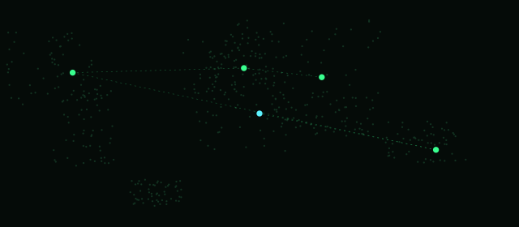
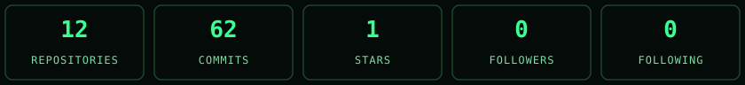

<div align="center">


</div>

<table width="100%">
<tr>
<td width="60%" valign="top">

### Hello, I'm
# `Xavier Kingsleen A`
### `SOC ANALYST`

&gt; Security Monitoring<br>&gt; Threat Detection<br>&gt; Incident Analysis<br>&gt; Turning Logs into Safer Tomorrows<br>
[](https://github.com/xavierkingsleen-11)
[](https://www.linkedin.com/in/xavierkingsleen01)
[](https://xavier11sr-myportfolio.netlify.app)
[](mailto:xavier.cloudsec@gmail.com)

> "Better Security, Safer Tomorrows" _

</td>
<td width="40%" valign="top" align="right">

```text
// SYSTEM STATUS

SYSTEM   : ONLINE
THREAT   : MONITORING
STATUS   : OPEN TO OPPORTUNITIES
LOCATION : TAMIL NADU, INDIA
```

`MONITOR` -> `DETECT` -> `INVESTIGATE` -> `RESPOND`
</td>
</tr>
</table>

---

<table width="100%">
<tr>
<td width="48%" valign="top">

### `// ABOUT ME`

BCA graduate focused on SOC Operations, Security Monitoring, Log Analysis, Linux, Windows Security, Windows Event Logs, PowerShell, Sysmon, Splunk, MITRE ATT&CK, Threat Detection, Alert Investigation, Incident Response and AWS Cloud Security.

Passionate about cybersecurity and aiming to build a career as a SOC Analyst, with a long-term goal in Cloud Security and AWS Security.

</td>
<td width="52%" valign="top">

### `// GLOBAL THREAT MONITORING`



**LOCATION**<br>Tamil Nadu, India

**STATUS**<br>Open to Opportunities

**FOCUS**<br>SOC Operations

<sub>REAL-TIME THREAT INTELLIGENCE | GLOBAL MONITORING | A SAFER TOMORROW</sub>

</td>
</tr>
</table>

---

### `// SKILLS & TECHNOLOGIES`

<table width="100%">
<tr>
<td width="20%" valign="top">

**SOC & SIEM**
- Splunk
- SPL
- Security Monitoring
- Alert Investigation
- Incident Response

</td>
<td width="20%" valign="top">

**Operating Systems**
- Linux
- Windows
- Linux CLI
- Windows Event Logs

</td>
<td width="20%" valign="top">

**Threat Detection**
- MITRE ATT&CK
- IOC Analysis
- Log Analysis
- Threat Hunting

</td>
<td width="20%" valign="top">

**Networking**
- TCP/IP
- IPv4/IPv6
- DNS
- DHCP
- ARP
- Subnetting
- VLAN
- NAT

</td>
<td width="20%" valign="top">

**Scripting & Tools**
- PowerShell
- Bash
- Sysmon
- Wireshark

</td>
</tr>
</table>

---

<table width="100%">
<tr>
<td width="45%" valign="top">

### `// SKILLS RADAR`


</td>
<td width="55%" valign="top">

### `// TOOLS & TECHNOLOGIES`

<p>
&nbsp;
&nbsp;
&nbsp;
&nbsp;
&nbsp;
&nbsp;
&nbsp;
&nbsp;
&nbsp;
&nbsp;
&nbsp;
&nbsp;
&nbsp;
&nbsp;
</p>

</td>
</tr>
</table>

---

### `// GITHUB ACTIVITY (LIVE)`

<div align="center">



</div>

<sub>Refreshed automatically by <code>.github/workflows/update-assets.yml</code> — see SETUP.md for the schedule.</sub>

---

<table width="100%">
<tr>
<td width="55%" valign="top">

### `// CONTRIBUTION GRAPH`

[](https://github.com/xavierkingsleen-11)

</td>
<td width="45%" valign="top">

### `// CONTRIBUTION SNAKE`


<sub>Generated by <code>.github/workflows/snake.yml</code> (Platane/snk) from your real contribution data.</sub>

</td>
</tr>
</table>

---

<table width="100%">
<tr>
<td width="34%" valign="top">

### `// EDUCATION`

**Bachelor of Computer Applications (BCA)**<br>
Sadakathullah Appa College, Tirunelveli<br>
`2023 – 2026`

**Higher Secondary Education (12th)**<br>
TNDTA RMP Pulamadan Chettiar National HR Sec School, Sathankulam<br>
`2022 – 2023`

</td>
<td width="33%" valign="top">

### `// CURRENT FOCUS`

- Enhancing detection engineering skills
- Building SOC labs and real-world scenarios
- Improving threat hunting capabilities
- Learning cloud security concepts
- Preparing for SOC Analyst L1 roles

</td>
<td width="33%" valign="top">

### `// LET'S CONNECT`

[](https://github.com/xavierkingsleen-11)
[](https://www.linkedin.com/in/xavierkingsleen01)
[](https://xavier11sr-myportfolio.netlify.app)
[](mailto:xavier.cloudsec@gmail.com)

</td>
</tr>
</table>

---

<div align="center">

### “Every log has a story. Every alert has a truth.”

— Logging off, Staying vigilant.

</div>