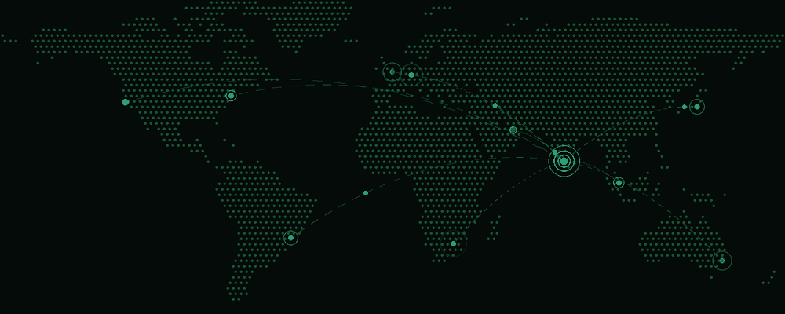
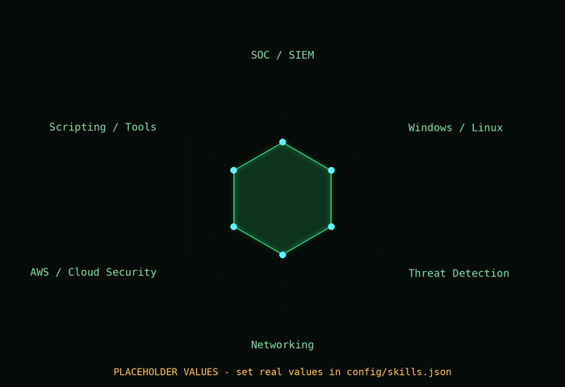
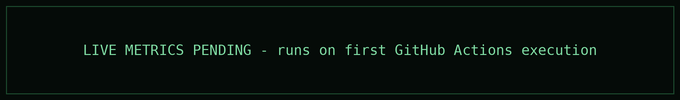

 

# `Xavier Kingsleen A`
### `SOC ANALYST`

&gt; Security Monitoring &gt; Threat Detection &gt; Incident Analysis 
 

> "Better Security, Safer Tomorrows" _

---

### `>_ About Me`

BCA graduate focused on SOC Operations, Security Monitoring, Log Analysis, Linux, Windows Security, Windows Event Logs, PowerShell, Sysmon, Splunk, MITRE ATT&CK, Threat Detection, Alert Investigation, Incident Response and AWS Cloud Security.

Passionate about cybersecurity and aiming to build a career as a SOC Analyst, with a long-term goal in Cloud Security and AWS Security.

---

### `// GLOBAL THREAT MONITORING`

**LOCATION** Tamil Nadu, India

**STATUS** Open to Opportunities

**FOCUS** SOC Operations

REAL-TIME THREAT INTELLIGENCE | GLOBAL MONITORING | A SAFER TOMORROW &mdash; visual simulation only, not real threat telemetry.

---

### `>_ Skills & Technologies`

#### `SOC & SIEM`
- Splunk
- SPL
- Security Monitoring
- Alert Investigation
- Incident Response

#### `Operating Systems`
- Linux
- Windows
- Linux CLI
- Windows Event Logs

#### `Threat Detection`
- MITRE ATT&CK
- IOC Analysis
- Log Analysis
- Threat Hunting

#### `Networking`
- TCP/IP
- IPv4/IPv6
- DNS
- DHCP
- ARP
- Subnetting
- VLAN
- NAT

#### `Scripting & Tools`
- PowerShell
- Bash
- Sysmon
- Wireshark

---

### `// SKILLS RADAR`

Profile visualisation values only - not certifications, exam scores or competency guarantees.

---

### `>_ Tools & Technologies`

<table align="center">
<tr>
<td align="center" width="140"> <b>Splunk</b></td>
<td align="center" width="140"> <b>Windows</b></td>
<td align="center" width="140"> <b>Linux</b></td>
<td align="center" width="140"> <b>PowerShell</b></td>
<td align="center" width="140"> <b>AWS</b></td>
</tr>
<tr>
<td align="center" width="140"> <b>MITRE ATT&CK</b></td>
<td align="center" width="140"> <b>Git</b></td>
<td align="center" width="140"> <b>GitHub</b></td>
<td align="center" width="140"> <b>HTML</b></td>
<td align="center" width="140"> <b>CSS</b></td>
</tr>
<tr>
<td align="center" width="140"> <b>Wireshark</b></td>
<td align="center" width="140"> <b>Kali Linux</b></td>
<td align="center" width="140"> <b>VirusTotal</b></td>
<td align="center" width="140"> <b>Shodan</b></td>
<td align="center" width="140"> <b>Nmap</b></td>
</tr>
</table>

---

### `>_ GitHub Activity`

Real numbers from the GitHub API, refreshed every 6 hours by <code>.github/workflows/update-assets.yml</code> (not second-by-second).

### `// CONTRIBUTION GRAPH`

Real contribution data for <code>xavierkingsleen-11</code> from GitHub (served live by the open-source github-readme-activity-graph service).

---

### `// CONTRIBUTION SNAKE`

Generated daily by <code>.github/workflows/snake.yml</code> (Platane/snk) from your real contribution data.

---

### `// EDUCATION`

**Bachelor of Computer Applications (BCA)** 
Sadakathullah Appa College, Tirunelveli 
`2023 – 2026`

**Higher Secondary Education (12th)** 
TNDTA RMP Pulamadan Chettiar National HR Sec School, Sathankulam 
`2022 – 2023`

---

### `>_ Current Focus`

- Enhancing detection engineering skills
- Building SOC labs and real-world scenarios
- Improving threat hunting capabilities
- Learning cloud security concepts
- Preparing for SOC Analyst L1 roles

---

### `>_ Let's Connect`

---

### “Every log has a story. Every alert has a truth.”

— Logging off, Staying vigilant.

